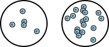

# Potential och spänning
Naturen består av partiklar. En del partiklar har något som kallas för laddning.
I kursen bryr vi oss inte så mycket om det, mer än att **elektronen** ger upphov till potentialskillnad (spänning) i material.

## Potential

Elektrisk potential är (typ) ett mått på hur stort underskott på elektroner ett föremål har.
- När ett föremål har *få elektroner* har den *hög potential*.
- När ett föremål har *mycket elektroner* har den *låg potential*.

*Bollen till vänster har högre potential.*

Ett problem med konceptet potential, är att det inte går att mäta... 

## Spänning

Det som däremot *går* att mäta är *skillnad i potential* mellan två [noder](#nod). Potentialskillnad är ett annat ord för <u>spänning</u>.

> ### Nod
> En <u>nod</u> är en punkt eller ett föremål som är helt ihopkopplat med sig själv, och allt har samma potential (potentialskillnad noll).
> 
> Det betyder att två ändar av en sladd är i den elektriska världen **samma nod**.
>
> Två punkter slutar vara samma nod om det finns någon **resistans** mellan dem. Senare i avsnittet lär vi oss att det bra att tänka på noder som **platser där komponenter möts**.