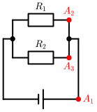
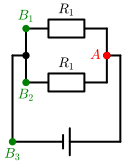
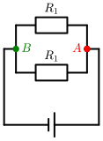

# Serie- och parallellkoppling

Hittills har vi tittat på den väldigt enkla kretsen med en spänningskälla och en resistans som tillsammans bestämmer strömmen. Ofta är elektriska system mer komplicerade än såhär. Det kan finnas fler resistorer och även fler spänningskällor. Dessa kan bli ihopkopplade på flera sätt. I grunden finns två sätt att koppla ihop komponenter: **Seriekoppling** och **parallellkoppling**.

## Seriekoppling
Seriekoppling av komponenter betyder att de är kopplade efter varandra så att strömmen som går igenom den ena komponenten är densamma som går igenom den andra.

### Resistorer i serie

Bilden nedan visar en krets med ett batteri och två resistorer som är seriekopplade. 


Vid kretsar som innehåller flera resistorer brukar dessa namnges enligt $R_1$, $R_2$, osv. 

Vid seriekoppling beräknas den totala resistansen i kretsen som summan av alla resistorer.

```admonish example title="Exempel: Totala resistansen"

**Beräkna strömmen, $I$, i kretsen nedan.**


Batteriet har spänningen $U=10 \volt$, $R_1 = 2 \ohm$ och $R_2 = 3 \ohm$.


**Lösning:**

Även här använder vi ohms lag ($U=R \cdot I$).

Eftersom det är den *totala* spänningen som är given så är det också den *totala resistansen* som vi behöver använda i formeln.


$$R _ {tot} = R_1 + R_2 = 2 + 3 = 5 \ohm$$

Löser vi ut strömmen ur ohms lag får vi:

$$I = U/R = 10 / 5 = 2 \ampere$$

Svar: $ I = 2 \ampere$
```

### Ersättningsresistans
I verkligheten finns inte resistorer med alla möjliga resistanser. Exempelvis är det väldigt svårt (om det ens är möjligt) att hitta en resistor med exakt resistansen $1050 \ohm$.
Då hade vi istället seriekopplat två resistorer, en med resistansen $1000 \ohm$ och en med $50 \ohm$. I teorin finns dock inget som säger att en resistor på $1050 \ohm$ inte kan finnas. Därför är det ofta fördelaktigt att ersätta flera resistorer med en enda när vi ska räkna teoretiskt. Detta kallas för ersättningsresistans. Vid seriekopplade komponenter är detta samma sak som den totala resistansen, $R _ {tot}$.

### Spänning över resistorer
När vi har använts oss av Ohms lag tidigare har vi alltid använt den totala spänningen och den totala resistansen i kretsen. Sanningen är att Ohms lag fungerar även på mindre skalor. Vet vi hur stort ett motstånd är och strömmen igenom den så kan vi också beräkna spänningen över motståndet. Vi kan beräkna spänningen över varje resistor som finns i en krets.


```admonish example title="Exempel: Delspänningar"
Nedan ser vi att kretsen har en spänningskälla med spänningen $10 \volt$. Utöver det finns 3 resistorer. $R_1 = 20 \ohm$, $R_2 = 50 \ohm$ och $R_3 = 30 \ohm$.


**Beräkna alla delspänningar, alltså spänningen över alla resistorer i kretsen.**

**Lösning:**

För att beräkna delspänningarna måste vi veta resistansen över varje resistor (dessa har vi givet) och strömmen som går igenom resistorerna. 

Strömmen genom resistorerna är densamma genom alla och är den totala strömmen i kretsen. Då måste vi beräkna strömmen!

Ohms lag: $I = U/R$

Vi har den totala spänningen $U = 10 \volt$. Den totala resistansen är $$R _ {tot} = R_1 + R_2 + R_3 = 20 + 50 + 30 = 100 \ohm$$

$$I = 10 / 100 = 0.1 \ampere$$

Nu har vi allt vi behöver för att beräkna delspänningarna.

$$U_1 = R_1I = 20 \cdot 0.1 = 2 \volt$$
$$U_2 = R_2I = 50 \cdot 0.1 = 5 \volt$$
$$U_3 = R_3I = 30 \cdot 0.1 = 3 \volt$$

```

### Spänningskällor i serie
En krets kan även ha fler spänningskällor, inte bara resistorer. Den totala spänningen av seriekopplade spänningskällor fungerar likadant som seriekopplade resistanser. Den totala spänningen blir summan av alla spänningar från de olika spänningskällorna.

```admonish example title =""

Har vi 2 batterier på $5\volt$ blir den totala spänningen $10\volt$.

Har vi spänningskällor som ger $10\volt$, $4\volt$ och $3\volt$ blir den totala spänningen $17\volt$.

```

### Potentialvandring
Som vi har nämnt tidigare är spänning en potentialskillnad mellan två noder. Olika noder är sådana "punkter" där potentialen inte är samma. Vi har också tidigare nämnt att den elektriska potentialen i kretsar ändras efter ett motstånd eller spänningskälla.

Går vi från battriets pluspol mot batteriets minuspol kommer vi att stöta på resistanser (om inte kretsen är kortsluten, och det vill vi ju inte!). Vid pluspolen är potentialen hög och efter varje resistor är potentialen lägre ända fram till batteriets minuspol då den är som lägst. 

```admonish success title=""

Dessa potentialskillnader som finns innan och efter resistorer är såna *delspänningar* som vi har räknat på [ovan](#admonition-exempel-delspänningar).
```

Fortsätter man att gå i strömmens riktning från minuspolen till pluspolen ökar potentialen med exakt batteriets spänning. Har man gått ett varv visar sig potentialskillnaden i en krets alltid vara noll. Detta är kirchhoffsspänningslag.

```admonish info title="Kirchhoffs spänningslag"
Summan av alla potentialändringar i en sluten krets är $0$.
```


Detta kan också formuleras som att summan av alla delspänningar över resistorerna är lika stort som summan av alla spänningar från spänningskällorna i en sluten krets. 


```admonish example title="Exempel: Kirchhoffs spänningslag"

Vi har en krets med två likadana batterier. Ett batteri har spänningen $U = 6 \volt$. Dessutom har vi två resistorer i kretsen. Spänningen över $R_1$ är $10 \volt$. 


**Beräkna spänningen över $R_2$.**

**Lösning:**

Den totala spänningen från batterierna är $$U _ {tot} = 2 \cdot 6 = 12 \volt$$

Delspänningen över $R_1$ är $ U_1 = 10 \volt$.

Med hjälp av kirchhoffs spänningslag vet vi att $$U _ {tot} - U_1 - U_2 = 0 \volt$$

Vi löser ut delspänningen över $R_2$ och får $$U_2 = U _ {tot} - U_1 = 12 - 10 = 2 \volt$$

Svar: $U_2 = 2 \volt$.

```

### Amperemeter
När vi senare ska labba kommer vi att använda amperemetrar för att ta reda på hur stor strömmen är i olika kretsar eller på olika delar av kretsen. En amperemeter ska kopplas i serie med komponenterna.

För att inte amperemetern ska påverka värdet har den en väldigt liten inre resistans. Skulle den vara stor skulle den totala resistansen ändras och därmed också strömmen. Då skulle vi inte kunna lita på mätvärdet. Som tur är har folk som skapat den tänkt till. 

### <u>Sammanfattning:</u>
- Seriekoppling är när komponenter kopplas in efter varandra så att strömmen igenom båda är densamma. 

- Finns flera resistorer serikopplade kan alla resistorer ersättas med en enda resistans, *ersättningsresistansen*. Den beräknas som summan av alla resistanser.

- Finns flera resistanser i en krets delar sig spänningen över de. Dessa spänningar kallas för delspänningar och kan beräknas med Ohms lag.

- Seriekopplade spänningskällor har en total spänning som beräknas med summan av alla spänningar från de separata spänningskällorna.

- Kirchhoffs spänningslag: Summan av alla potentialändringar i en sluten krets är noll.

- Om vi potentialvandrar i strömmens riktning ökar potentialen med spänningskällors spänning och minskar med spänningen över resistorerna.

- En amperemeter ska kopplas i serie.


## Parallellkoppling
Det som kännetecknar parallellkopplingar är att det finns förgreningar i kretsen som leder till att strömmen i vissar delar i kretsen inte kommer att vara den totala strömmen. 

```admonish question title="Vad är poängen med parallellkoppling?"

<!-- TODO: FIXTHIS -->


Som vi lärde oss ovan är paralellkoppling när det finns flera vägar för strömmen att ta. Detta medför oftast att strömmen delar upp sig i så kallade delströmmar och åker igenom alla parallella vägar.

Detta brukar användas i praktiken vid till exempel julbelysning. Har du någonsin märkt att ljusslingans ena ljus har gått sönder och slocknat, samtidigt som de andra ljusen lyser fortfarande. Detta har att göra med att ljusen är parallellkopplade. När ena ljuset går sönder gör det inte så mycket för kretsen är fortfarande sluten för alla andra ljus och strömmen kan flöda. Då är det lätt att se vilken som behöver bytas och allt blir inte helt mörkt. 

Hade alla lampor varit seriekopplade skulle kretsen brytas så fort en lampa går sönder och vi hade inte vetat vilken lampa som var den söndriga.

```

### Resistorer parallellt kopplade

Nedan syns en krets med ett batteri och två parallellkopplade resistorer.
Även här kan det vara fördelaktigt att beräkna ersättningsresistansen. 


#### Ersättningsresistans
Ersättningsresistansen kallas den resistansen som kan ersätta två eller fler resistanser. Vid seriekopplade resistanser vet vi att ersättningsresistansen beräknades som summan av resistanserna. Tyvärr är den inte lika intuitiv för parallellkopplingar. 

Vid parallella resistorer beräknas ersättningsresistansen enligt
$$\frac{1}{R _ {ersättning}} = \frac{1}{R_1} + \frac{1}{R_2} + \frac{1}{R_3}$$

osv för så många resistorer som är parallellt kopplade.

```admonish example title="Exempel: Ersättningsresistanser"

I krets finns två resistorer kopplade parallellt, $R_1 = 5 \ohm$ och $R_2 = 3 \ohm$. Du vill ersätta de två resistorerna med en enda resistor. **Hur stor resistans bör den nya resistorn ha?**


Lösning: 
$$\frac{1}{R _ {ersättning}} = \frac{1}{R_1} + \frac{1}{R_2}$$
$$\frac{1}{R _ {ersättning}} = \frac{1}{5} + \frac{1}{3} = \frac{3}{15} + \frac{5}{15} = \frac{8}{15}$$

För att få $R _ {ersättning}$ måste vi vända på bråket, täljare ska bli nämnare och nämnare blir täljare:

$$R _ {ersättning} = \frac{15}{8} \ohm$$

**Svar:** Vi kan ersätta de två resistorerna i kretsen med en resistor med resistansen $\frac{15}{8} \ohm$. 

```

Efter att har beräknat ersättningsresistansen kan kretschemat ritas om som en krets med enbart en resistor, och beräkningarna kan fortsätta som vi tidigare har lärt oss.

```admonish example title="Exempel: Resistorer parallellt"

I en krets finns ett batteri med spänningen $U = 42 \volt$, och två resistorer där $R_1 = 70 \ohm$ och $R_2 = 30 \ohm$. **Beräkna den total strömmen i kretsen.**


Enligt Ohms lag gäller:

$$I = U / R$$

$I$ är den totala strömmen i kretsen, $U$ är spänningen i kretsen och $R$ är den totala resistansen i kretsen.

Den totala resistansen är ersättningsresistansen och fås enligt

$$\frac{1}{R _ {ersättning}} = \frac{1}{R_1} + \frac{1}{R_2}$$
$$\frac{1}{R _ {ersättning}} = \frac{1}{70} + \frac{1}{30} = \frac{30}{2100} + \frac{70}{2100} = \frac{100}{2100}$$

$$R _ {ersättning} = \frac{2100}{100} = 21 \ohm$$

Nu när vi har ersättningsresistansen kan vi rita kretsen nedan.


$$I = U/R = 42/21 = 2 \ampere$$

**Svar:** $I = 2 \ampere$.


```


### Kirchhoffs strömlag
Som vi har lärt oss tidigare innebär parallellkoppling att det finns minst en förgrening i kretsen där den totala strömmen kan dela på sig i så kallade delströmmar. 

I en seriekopplad krets är den totala strömmen, $I$, densamma som strömmen genom HELA kretsen. Den har ju ingen annan stans att ta vägen. 


Vid parallellt kopplade komponenter kommer en del av strömmen att ta ena vägen medan den andra delen av strömmen tar den andra vägen. 


Strömmen vill ta den lättaste vägen. Har vi alltså två parallellt kopplade resistorer, där den ena har en lägre resistans kommer att mer ström att strömma där igenom. 

Ni kan tänka er att det finns två vägar att ta till skolan. Den snabbaste/lättaste vägen är den som alla vill ta. Men ni vet att när det är rusningstrafik får man ibland ta den längre/jobbigare vägen för att komma fram i tid. De flesta människorna kommer att ta den snabbare vägen till skolan, men det finns en mindre andel som tar omvägen för att skippa rusningstrafiken.

På samma sätt fungerar ström. Strömmen kommer att ta den vägen som har minst motstånd, men en mindre andel av strömmen måste ta omvägen.

Om man fortsätter resonera kommer man fram till Kirchhoffs strömlag.

```admonish info title="Kirchhoffs strömlag"

Den totala strömmen in i en nod i en krets är är lika med den totala strömmen som lämnar noden.
```


Vad betyder detta? Jo, om du tänker dig att du har en punkt och det finns några strömmar in mot den här punkten. Strömmar kan aldrig bli stilla utan måste fortsätta och då måste de också komma ut ur punkten.

```admonish example title="Exempel: Kirchoffs strömlag"

In i en punkt flödar tre strömmar, $I_1 = 2 \ampere, I_2 = 6 \ampere, I_3 = 5 \ampere$.

Ut ur punkten kommer två strömmar, $I_4 = 11 \ampere $ och $I_5 =?$

**Bestäm den totala strömmen in i punkten, den totala strömmen ut ur punkten och strömmen $I_5$.**

Lösning:

Den totala strömmen in är summan av alla strömmar in i punkten. 

$$I _ {in} = I_1 + I_2 + I_3 =2 + 6 + 5 = 13\ampere$$

Den totala strömmen ut ur punkten är enligt Kirchhoffs strömlag lika stor som strömmen in i punkten. 

$$I _ {in} = I _ {ut} = 13\ampere$$

$$I _ {ut} = I_4 + I_5$$
$$I_5 = I _ {ut} - I_4 = 13-11 = 2\ampere$$

**Svar:** Den totala strömmen in i punkten och den totala strömmen ut ur punkten är $13 \ampere$ och $I_5 = 2\ampere$.

```


### Spänning vid parallellkoppling
I en seriekoppling vet vi att spännigen från spänningskällan delar sig över resistorerna som finns. Vad är fallet vid parallellkopplingar?





Om vi potentialvandrar längs med en parallellkopplad krets från spänningskällans pluspol mot minuspolen ser vi att mellan punkt A1 och A2 finns ingen potentialskillnad. Detta vet vi för att det inte finns något motstånd eller någon spänningskälla mellan A1 och A2 så därför kan inte potentialen varken minska eller öka. Med exakt samma resonemang ser vi att potentialen inte ändras mellan A1 och A3. Ingen potentialskillnad betyder att alla dessa punkter tillhör samma **nod** 

<!-- TODo [Länka till nodrubriken i tidigare avsnitt]. -->

Då kan vi markera förgreningen innan resistorerna som nod A.

```admonish tip title="Beteckna noder"

Ofta är det bra att markera noderna mellan resistorer ifall dessa är seriekopplade eller vid förgreningar vid parallellkopplingar.

```

Då kan vi markera förgreningen innan resistorerna som nod A.




Om vi fortsätter vår potentialvandring från A genom $R_1$ vet vi att potentialen kommer att minska  med spänningen som ligger över resistorn. Vi kan kalla den punkten för B1. Vandrar vi från A genom $R_1$ kommer vi till punkten B2. Eftersom att det inte finns något resistans eller någon spänningskälla mellan B1 och B2 eller B3 måste dessa vara samma noder. Vi kan markera noden B i förgreningen.



Det vi har kommit fram till nu är att vid parallellkopplingar av resistorer finns det en nod vid förgreningen innan resistorerna och en nod vid förgreningen efter dem. Vilken väg vi än väljer att gå igenom är potentialskillnaden lika stor mellan A och B, alltså spänningen över alla grenar är lika stora. Detta gäller ALLTID. Vi kommer kolla på mer komplicerade kretsar framöver och även där gäller det att vid parallellkopplingar är spänningen över grenarna lika stora.

```admonish info title="Parallellkoppling"

När spänningskällan är parallellkopplad med resistorerna kommer spänningen över varje gren vara lika stor som spänningen över spänningskällan.

```

```admonish example title="Exempel: Delströmmar och paralella resistorer"

I en krets finns ett batteri på med spänningen $U = 15 \volt$. Den är parallellkopplad med resistorerna $R_1 = 20 \ohm$ respektive $R_2 = ? \ohm$ enligt bilden nedan.

Den totala strömmen är $I _ {tot} = 1 \ampere$.


BILD: ett batteri, två parallella R, döp de till R1 = 20 ohm och R2. Rita ut I = 1 A vid pluspolen, I1 vid, I2 vid R2 ooch I3 vid minuspolen (I3 = I men det är något jag vill leda de fram till därför har jag lite sneaky beteckning.) plus noden A i frögreningen framför R.

**a) Beräkna delströmmarna $I_1$ och $I_2$.**

**b) Beräkna $R_2$.**

**c) Bestäm också $I_3$.**

Lösning:

a) $I_1$ kan vi beräkna m.h.a Ohms lag:

$$I_1 = U_1 / R_1$$

Där $U_1$ är spänningen över $R_1$, $U_1 = U = 15\volt$.

$$I_1 = 15 / 20 = 7.5/10 = \underline{0.75 \ampere}$$

Om vi betraktar noden A ser vi att strömmen in är $I _ {tot}$ och strömmarna ut är $I_1$ och $I_2$.Vi vet då att $$I _ {tot} = I_1 + I_2$$

$$I_2 = I _ {tot} - I_1 = 1 - 0.75 = \underline{0.25 \ampere}$$


b) Vi utnyttjar Ohms lag även här.

$$R_2 = U_2 / I_2 = 15 / 0.25 = \underline{60\ohm}$$

c) Vid förgreningen efter resistorerna möts $I_1$ och $I_2$ igen så 

$$I_3 = I_1 + I_2 = I _ {tot} = \underline{1 \ampere}$$

**Svar:**

a) $I_1 = 0.75 \ampere$, $I_2 = 0.25 \ampere$  
b) $R_2 = 60 \ohm$   
c) $I_3 = 1 \ampere$.

```


### Parallella spänningskällor


### Voltmeter


## Kombination av kopplingarna.

### Ersättningsresistans

### Strömmen innan en förgrening och efter mergningen är den totala strömmen.


