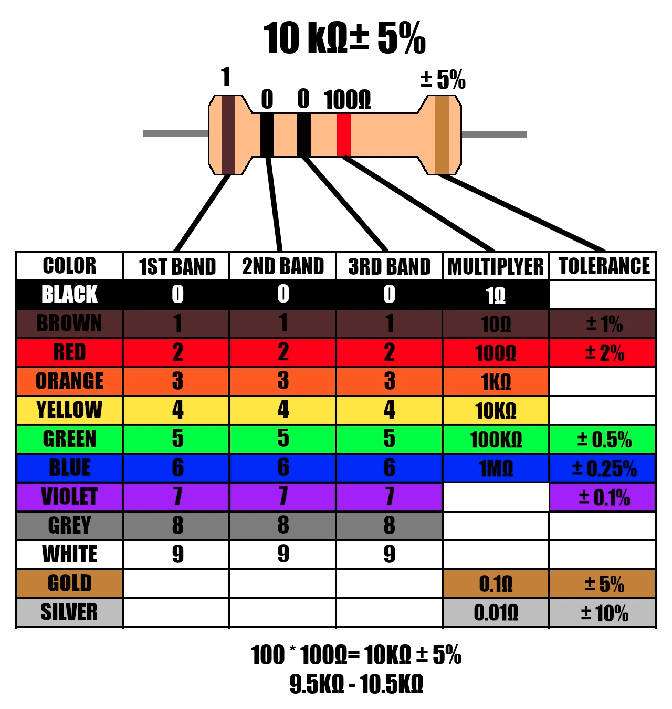

# Ström och resistans

## Ström
En ström är en strömning av partiklar som uppstår för att någon typ av kraft verkar på dem. I naturen finns exempelvis vattenströmning som sker när vatten finns högt uppe, då verkar gravitationen på den och vattnet strömmar ner. Ett annat exempel är temperaturströmning. Ifall något varmt rör vid något kallt kommer temperaturen av de båda kropparna att jämnas ut på grund av termodynamiska lagar som vi inte ska gå in på här.

På liknande sätt finns elektrisk strömning som uppstår på grund av en potentialskillnad, med andra ord: en spänning, som verkar på de elektriska partiklarna. Ifall det senare i kapitlet bara står "ström" eller "el" menas elektrisk ström. 

```admonish info title="Storhet och enhet"
Den elektriska strömen betecknas $I$ och har enheten  ampere, $\ampere$.

Strömmen kan mätas med en så kallad *amperemeter*. Det är vanligt att ha ett gemensamt mätinstrument som kan mäta både spänning och ström. Detta intrument kallas *multimeter*.
```

En elektrisk ström innebär att negativa elektriska partiklar (elektroner och negativa joner) förflyttas. Så om partiklarna inte har en väg som de kan förflyttas längs med kan ingen ström uppstå.

```admonish info title="Det finns alltså två kriterier för att en ström ska uppstå"
1. Potentialskillnad (spänning).
1. Någon form av väg för partiklarna att strömma igenom.
```


## Ledare, halvledare och isolatorer
Vad finns det för olika typer av "vägar"? I en krets används oftast sladdar som består av någon metall inuti och har ett gummihölje runt. Metaller leder ström väldigt bra på grund av deras kemiska struktur. Ämnen som har den egenskapen kallas för **ledare**. 

Gummihöljet finns av säkerhetskäl och för att minimera risken för kortslutning. Gummi är ett material som används eftersom den leder ström väldigt dåligt. Sådana ämnen kallas för **isolatorer**. 

Utöver ledare och isolatorer finns kategorin **halvledare**, som varken är speciellt bra eller dåliga ledare. Halvledare kännetecknas av att ledningsförmågan varierar med omständigheterna. I vanliga fall är ledningsförmågan relativt dålig, men när energi tillförs i form av värme eller ljus förbättras ledningen.

```admonish question title="Varför finns olika bra ledare?"
Den kemiska strukturen är den som avgör hur bra ett ämne leder ström. Metallatomer sätter sig i en speciell kristallstruktur som tillåter de olika atomerna att ha gemensamma elektroner. Detta betyder att det finns fria negativa laddningar över att skapa strömmen. Isolatorer har starka kemiska bindningar mellan elektronerna och resten av atomen, de är alltså ovilliga att "låna ut" sina elektroner och är därför dåliga ledare. 
```


## Resistans
Elektriskt motstånd har också ett fysikaliskt namn, vilket är **resistans**. Hur bra ledare något är kan också beskrivas med en fysikalisk storhet, *resistivitet*. Resistansen som strömmen måste överkomma i en ledare beror direkt på ämnets resistivitet. Bra ledare har låg resistivitet och isolatorer har hög. 

```admonish info title="Storhet och enhet"
Resistans beteckans $R$ och har enheten ohm $\ohm$.
```

Ett materials ledningsförmåga har att göra med den *inre* resistansen hos materialet. Utöver den finns det elektroniska komponenter vars uppgift är att skapa resistans i en krets. Dessa kallas **resistorer**. 


Det finns resistorer med olika stor resistans. För att veta vilken resistor man jobbar med kan man kolla på resistorn själv. Den har några färglada streck över sig. De olika färgerna är kopplade till olika siffror. Genom att kolla på en tabell (eller om man kan de utantill) är det lätt att avgöra hur stor resistansen är i resistorn.


*Hur man kan beräkna motståndet från färgerna (5-band resistor)*

```admonish question title="Varför vill vi ha resistorer i kretsen?"

Man kan tänka på resistanser som stenar i en flod. Vattnet strömmar och stöter på stenarna. Motståndet gör så att strömmen inte kan vara så stor och vattnet flödar långsammare. 

Liknande roll har resistansen i elektriska sammanhang. 

Om man kopplar samman en spänningskälla med bra ledare och inget annat motstånd mellan spänningskällans olika poler skulle kretsen vara kortsluten. Den blir snabbt väldigt varm och en brandrisk. Genom att ha motstånd som "saktar ner" (minskar) strömmen blir inte komponenterna så varma och håller längre.
```


I nästa kapitel lär vi oss hur allt detta hänger ihop, med [ohms lag](../ohms-lag/index.md).
