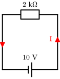

# Uppgifter

<ol>

<li>

Hur stor är **strömmen** i kretsen?

Svar

**SVAR:** $I = 5\milli\ampere$

---

$U = 10\volt$, $R=2\kilo\ohm$.

$$ I = U/R $$
$$ I = \frac{10\volt}{2\kilo\ohm} = 5\milli\ampere $$

</li>

<li>

Hur stor resistans i kretsen?

Svar

**SVAR:** $R = 500\ohm$

---

$U = 3.3\volt$, $I=6.6\milli\ohm$.

$$ R = U/I $$
$$ R = \frac{3.3\volt}{6.6\milli\ampere} = 500\ohm $$

</li>

<li>

Hur stor spänning behövs i kretsen?

Svar

**SVAR:** $U = 23\volt$

---

$R = 1\kilo\ohm$, $I=23\milli\ohm$.

$$ U = R I $$
$$ U = 1\kilo\ohm \cdot 23\milli\ampere = 23\volt $$

</li>

<li>

Hur mycket spänning ligger över varje resistor?

Svar

**SVAR:** $U_1 = 4\volt$, $U_2 = 8\volt$

---

Man kan lösa detta på två sätt: antingen genom att först räkna ut totala strömmen och applicera Ohms lag, eller så kan man ta hjälp av **KVL**.

**Ohms lag:**

$U = 12\volt$, $R_1=2\kilo\ohm$, $R_2=4\kilo\ohm$.

$R _ {tot} = R_1 + R_2 = 6\kilo\ohm$

$$ I = \frac{U}{ R _ {tot} } = \frac{12\volt}{6\kilo\ohm} = 2\milli\ampere $$

$$ U_1 = I R_1 = 2\milli\ampere \cdot 2\kilo\ohm = 4\volt $$

$$ U_2 = I R_2 = 2\milli\ampere \cdot 4\kilo\ohm = 8\volt $$

**KVL:**

$R _ {tot} = R_1 + R_2 = 6\kilo\ohm$

$$ U_1 = U * \frac{R_1}{R _ {tot}} = 12\volt \cdot \frac{2\kilo\ohm}{6\kilo\ohm} = 4\volt $$

$$ U_2 = U - U_1 = 12\volt - 4\volt = 8\volt $$

</li>

<li>

Hur mycket spänning ligger över varje resistor?

Svar

**SVAR:** $U_1 = 4\volt$, $U_2 = 8\volt$

---

Man kan lösa detta på två sätt: antingen genom att först räkna ut totala strömmen och applicera Ohms lag, eller så kan man ta hjälp av **KVL**.

**Ohms lag:**

$U = 12\volt$, $R_1=2\kilo\ohm$, $R_2=4\kilo\ohm$.

$R _ {tot} = R_1 + R_2 = 6\kilo\ohm$

$$ I = \frac{U}{ R _ {tot} } = \frac{12\volt}{6\kilo\ohm} = 2\milli\ampere $$

$$ U_1 = I R_1 = 2\milli\ampere \cdot 2\kilo\ohm = 4\volt $$

$$ U_2 = I R_2 = 2\milli\ampere \cdot 4\kilo\ohm = 8\volt $$

**KVL:**

$R _ {tot} = R_1 + R_2 = 6\kilo\ohm$

$$ U_1 = U * \frac{R_1}{R _ {tot}} = 12\volt \cdot \frac{2\kilo\ohm}{6\kilo\ohm} = 4\volt $$

$$ U_2 = U - U_1 = 12\volt - 4\volt = 8\volt $$

</li>

</ol>