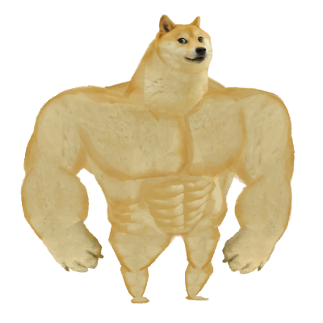

# Komponenter

Det finns en mängd olika komponenter som används inom mekatronik. Det kan kännas överväldigande att det finns så många olika, men sanningen är att det bara finns tre (3) huvudsakliga komponenter!

## Aktuator
Så fort man vill få något att röra på sig, då ska man använda sig av en _aktuator_. Här kommer några vanliga exempel på aktuatorer.

> ### Muskel
> 
> Vi människor har muskler som är aktuatorer. De kan dra ihop sig och därmed skapa rörelse. Våra muskler drivs av elektriska signaler från hjärnan (som är en [styrenhet](#styrenhet)).

> ### DC-motor
> 
> En DC-motor är en elektrisk motor som drivs av likström
(DC, direct current, är engelska för likström).
>
> Den är bra lämpad för att skapa rotation när det viktiga är att det snurrar, men kanske inte lika viktigt hur exakt det snurrar.
>
> En användning för DC-motorer är att driva hjulen på en radiostyrd bil.

> ### Servomotor
> 
> En servo är till skillnad från en [DC-motor](#dc-motor) inte gjord att snurra flera varv, utan att ställa in sig på en viss vinkel. Vanligtvis kan en servo ställa in sig på en vinkel mellan 0&deg; och 180&deg;.
>
> En användning för en servomotor är att skapa styrning till en radiostyrd bil.

## Sensor

> ### Ögon

## Styrenhet

För att skapa logik,
